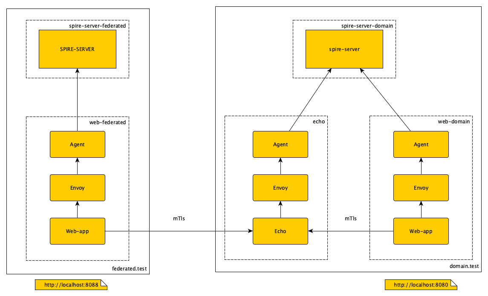

# Envoy 1.19.0 SDS Example with SPIRE 1.0.2

## Requirements

- Go 1.14
- docker-compose

## Diagram



## Build

```
$ ./build.sh
```

## Run

```
$ docker-compose up -d
```

## Start Web and Echo Servers

```
$ ./1-start-services.sh
```

## Start SPIRE Agents 

```
$ ./2-start-spire-agents.sh
```

## Create Workload Registration Entries

```
$ ./3-create-registration-entries.sh
```

## Interact with Web Server

Open up a browser to http://localhost:8080 to test out:

- Direct connection between Web and Echo servers
- mTLS connection between Web and Echo servers via Envoy
- TLS connection between Web and Echo servers via Envoy

## Interact with Federated Web Server

Open up a browser to http://localhost:8088 to test out:

- Direct connection between Web and Echo servers
- mTLS connection between Web and Echo servers via Envoy
- TLS connection between Web and Echo servers via Envoy
**NOTE** It may take a 30 seconds or so for Envoy to reconnect to upstream
after the registration entries are created.

## Clean up

```
$ docker-compose down
```

## Miscellaneous

### Regenerating Agent Certificates for X509PoP attestation

If you want to regenerate the agent certificates, you use
the gencerts.go Go script, supplying the names of all the services.

```
$ go run gencerts.go web echo
74613bb92549782b5d01ad5e6e93cedd78841683 web
14e6255ca2a1f32198656fc400f82d242ccf44f2 echo
```

This script creates a new CA keypair that is used to sign the service
certificates. It replaces the agent keypairs in the docker
configurations for each service, as well as the agent cacert in the
spire-server configuration.

After running, you must rerun `build.sh` to rebuild the containers with the
changes.
